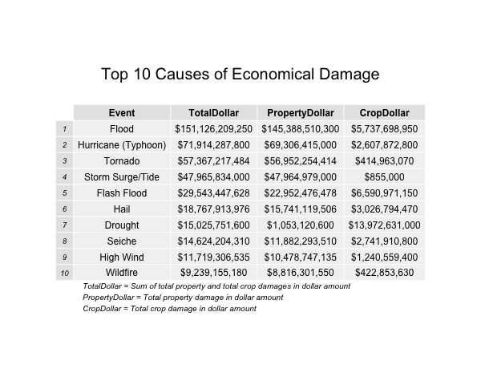
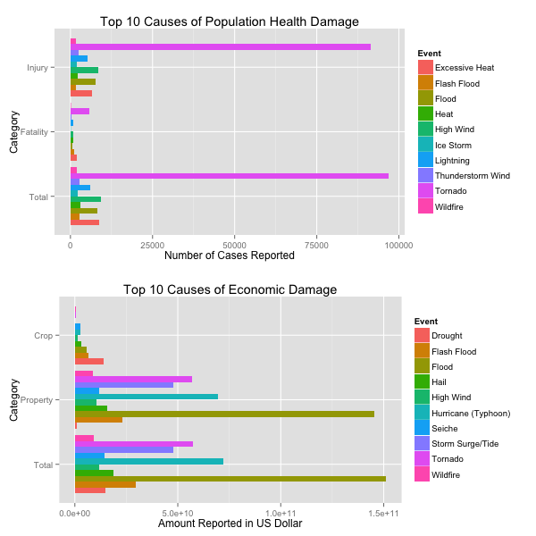

## Synopsis  
The present data set came from U.S. National Oceanic and Atmospheric Administration's (NOAA) storm database, which tracked characteristics of major storms and weather events in the United States, including when and where they occur, as well as estimates of any fatalities, injuries, and property damage in the period between 1950 and November 2011. This document layouts the analysis procedures, such as cleaning event labels and calculating damages in dollar amount. The goal of the analysis was to identify events that were most harmful with respect to population health and events that had the greatest economic consequences. In terms of population health, number of fatality and injury cases reported were examined. In terms of economic consequences, amount of property and crop damage was examined. The analysis found that Tornado, High Wind and Excessive Heat were the top events that led to the most negative population health outcomes, whereas Flood, Hurricane (Typhoos) and Tornado resulted in the most negative economical consequences.  
  
## Data Processing  
First, go to the right directory and read in data. Data is stored in ../data/ folder.  
```{r setoptions, echo=TRUE, message=FALSE, warning=FALSE}
setwd('~/Documents/Coursera/ReproducibleResearch/RepData_PeerAssessment2')
d = read.csv('../data/repdata-data-StormData.csv.bz2', header = TRUE)

# Convert crop and property damage into dollor amount. h/H for hundreds, K/k for thousands, M/m for millions, and B/b for billions. Numbers are 10^x
# Property Damage
d$propDmgInDollar=0
exp = levels(d$PROPDMGEXP)[5:length(levels(d$PROPDMGEXP))] 
expMulti = c(10^0,10^1,10^2,10^3,10^4,10^5,10^6,10^7,10^8,10^9,10^2,10^2,10^3,10^6,10^6)

for (i in 1:length(exp)){
  targetRow = grepl(exp[i],d$PROPDMGEXP)
  d$propDmgInDollar[targetRow] = d$PROPDMG[targetRow] * expMulti[i] 
}

# Crop damage
d$cropDmgInDollar=0
exp = levels(d$CROPDMGEXP)[3:length(levels(d$CROPDMGEXP))]
expMulti = c(10^0,10^2,10^9,10^3,10^3,10^6,10^6)
for (i in 1:length(exp)){
  targetRow = grepl(exp[i],d$CROPDMGEXP)
  d$cropDmgInDollar[targetRow] = d$CROPDMG[targetRow] * expMulti[i] 
}
```

Match events in data as much as possible to those listed in the Storm Data Documentation for categolization    
```{r}
# Based on the Storm Data Documentation, create 48 events. 
events48 = c('Astronomical Low Tide','Avalanche','Blizzard','Coastal Flood', 'Cold/Wind Chill', 'Debris Flow','Dense Fog','Dense Smoke', 'Drought','Dust Devil','Dust Storm', 'Excessive Heat', 'Extreme Cold/Wind Chill', 'Flash Flood', 'Flood', 'Frost/Freeze', 'Funnel Cloud', 'Freezing Fog', 'Hail', 'Heat', 'Heavy Rain', 'Heavy Snow', 'High Surf', 'High Wind', 'Hurricane (Typhoon)', 'Ice Storm', 'Lake-Effect Snow', 'Lakeshore Flood', 'Lightning', 'Marine Hail', 'Marine High Wind', 'Marine Strong Wind', 'Marine Thunderstorm Wind', 'Rip Current', 'Seiche', 'Sleet', 'Storm Surge/Tide', 'Strong Wind','Thunderstorm Wind', 'Tornado', 'Tropical Depression', 'Tropical Storm', 'Tsunami', 'Volcanic Ash','Waterspout', 'Wildfire', 'Winter Storm','Winter Weather')

# Convert all events in the list and in data to lower case to calculate Approximate String Distances
events48 = tolower(events48) 
d$EVTYPE = tolower(d$EVTYPE)

# Find events that match the entries as close as apossible
eventID = function(x){
  which(min(adist(x,events48))==adist(x,events48))
}
tmp = sapply(d$EVTYPE,eventID,simplify = "array")

# Then add the matched event type to the original data. If algorythm was not able to find one closest match, it will categorize as 'other'
cleanEvent = NULL
for (i in 1:dim(d)[1]){
  if (length(tmp[[i]])==1){
      cleanEvent[i] = events48[tmp[[i]]]
  } else {
    cleanEvent[i] = 'other'
  }
}
d$EVTYPE_clean=cleanEvent
d$EVTYPE_clean = gsub("(\\w)(\\w*)", "\\U\\1\\L\\2", d$EVTYPE_clean, perl=TRUE) # back to Uppercase-lowercase
```

Now examine the magnitude of damage in terms of population health. I will select the number of fatalities, injuries, and the total of these variables by events.  
```{r top10popHealthDamage, message=FALSE, warning=FALSE, results='hide'}
library(sqldf)
library(ggplot2)
library(gridExtra)
library(OIdata)
library(scales)

dPopHealth = sqldf('select EVTYPE_clean as Event, sum(FATALITIES + INJURIES) as Total, sum(FATALITIES) as Fatality, sum(INJURIES) as Injury from d group by EVTYPE_clean order by sum(FATALITIES + INJURIES) DESC')

# save the table for visualization
png(filename = "top10PopHealthDamage.png", width=600,height=480) 
grid.newpage()
table = tableGrob(dPopHealth[1:10,])
h <- grobHeight(table)
w <- grobWidth(table)
title <- textGrob("Top 10 Causes of Population Health Damage", y=unit(0.5,"npc") + 0.5*h, 
                  vjust=0, gp=gpar(fontsize=20))
footnote1 <- textGrob("Total = Sum of total fatalities and injuries", 
                     x=unit(0.5,"npc") - 0.5*w,
                     y=unit(0.5,"npc") - 0.55*h,
                     vjust=1, hjust=0, gp=gpar(fontface="italic",fontsize=10))
footnote2 <- textGrob("Fatality = Total number of fatalities", 
                     x=unit(0.5,"npc") - 0.5*w,
                     y=unit(0.5,"npc") - 0.62*h, 
                     vjust=1, hjust=0, gp=gpar(fontface="italic",fontsize=10))
footnote3 <- textGrob("Injury = Total number of injuries", 
                     x=unit(0.5,"npc") - 0.5*w,
                     y=unit(0.5,"npc") - 0.69*h, 
                     vjust=1, hjust=0, gp=gpar(fontface="italic",fontsize=10))
gt <- gTree(children=gList(table, title, footnote1,footnote2,footnote3))
grid.draw(gt)
dev.off()
```

Then, examine the magnitude of damage in terms of economic consequences. I will select dollar amount of property and crop damage, and the total of these variablesby events.  
``` {r top10econDamage, results='hide'}
dEcon = sqldf('select EVTYPE_clean as Event, sum(propDmgInDollar + cropDmgInDollar) as Total, sum(propDmgInDollar) as Property, sum(cropDmgInDollar) as Crop from d group by EVTYPE_clean order by sum(propDmgInDollar + cropDmgInDollar) DESC')
dEcon$TotalDollar = dollar(dEcon$Total)
dEcon$PropertyDollar = dollar(dEcon$Property)
dEcon$CropDollar = dollar(dEcon$Crop)

# save the table for visualization
png(filename = "top10econDamage.png", width=600,height=480) 
grid.newpage()
table = tableGrob(dEcon[1:10,c('Event','TotalDollar','PropertyDollar','CropDollar')])
h <- grobHeight(table)
w <- grobWidth(table)
title <- textGrob("Top 10 Causes of Economical Damage", y=unit(0.5,"npc") + 0.5*h, 
                  vjust=0, gp=gpar(fontsize=20))
footnote1 <- textGrob("TotalDollar = Sum of total property and total crop damages in dollar amount", 
                     x=unit(0.5,"npc") - 0.5*w,
                     y=unit(0.5,"npc") - 0.55*h,
                     vjust=1, hjust=0, gp=gpar(fontface="italic",fontsize=10))
footnote2 <- textGrob("PropertyDollar = Total property damage in dollar amount", 
                     x=unit(0.5,"npc") - 0.5*w,
                     y=unit(0.5,"npc") - 0.62*h, 
                     vjust=1, hjust=0, gp=gpar(fontface="italic",fontsize=10))
footnote3 <- textGrob("CropDollar = Total crop damage in dollar amount", 
                     x=unit(0.5,"npc") - 0.5*w,
                     y=unit(0.5,"npc") - 0.69*h, 
                     vjust=1, hjust=0, gp=gpar(fontface="italic",fontsize=10))
gt <- gTree(children=gList(table, title, footnote1,footnote2,footnote3))
grid.draw(gt)
dev.off()
```

To visualize easier I create bar graphs on top  one another.  
``` {r histTop10}
library(reshape2)
dfEcon = melt(dEcon[1:10,], measure.vars = c("Total", "Property","Crop"), variable.name = 'Category',value.name = 'variable')
dfHealth = melt(dPopHealth[1:10,], measure.vars = c("Total", "Fatality","Injury"), variable.name = 'Category',value.name = 'variable')

# now plot row-wise & save
png(filename = "histTop10.png", width=600,height=600)

gHealth = ggplot(dfHealth, aes(x=Category, y=variable, fill=Event)) +
  geom_bar(stat='identity',position='dodge') +
  labs(list(title = 'Top 10 Causes of Population Health Damage', 
            x = "Category", 
            y = "Number of Cases Reported")) +
            coord_flip()

gEcon = ggplot(dfEcon, aes(x=Category, y=variable, fill=Event)) +
  geom_bar(stat='identity',position='dodge') +
  labs(list(title = 'Top 10 Causes of Economic Damage', 
            x = "Category", 
            y = "Amount Reported in US Dollar"))+
            coord_flip()

grid.arrange(gHealth, gEcon, ncol=1)

dev.off()
```

## Results
The present analysis analyzed the effect of severe weather events on population health and economy based on the data collected between 1950 and 2011.    


Table above lists the 10 most severe weather events in terms of **population health**, sorted by the sum of fatalities and injuries.     

Tornade caused by far the most number of both fatalities and injuries compared to any other events. Following Tornado, High Wind caused the second largest number of total population health damage, because of its high incidence of injuries, but not neccessarily fatalities. Excessive heat, though ranked third by total cases, actually caused more fatalities than High Wind. Events ranked between second and fifth appeared to have very high number of injuries, resulted in considerably higher Total damage than other events. In fact, the Total number of cases for the 5th most severe event (Lightening) is almost double those of the 6th event (Heat).       


Table above lists the 10 most severe weather events in terms of **economic consequences**, sorted by the sum of dollar amounts from propoerty and crop damages.  

Flood caused the most severe damage to the economy; in fact, more than double the damage than the second event, Hurricane (Typhoon) in both Property and Crop (thus, Total as well). Tornade ranked third, close to Hurricane (Typhoon)'s Property damage, but not in Crop damage. The negative effects of the forth event, Storm surge/Tide were focused on Property damages.  


Figure above provides the visual description of the results. Top graph summarizes the same top 10 events in the first table above, based on Injury, Fatality, and Total of those reports. Bottom graph summarizes the same top 10 events in the second table above, based on Crop and Property damage, and Total of them in dollar amount.  

It is clerly shown that the Tornade's negative effect to the population health was due to its high incidence of injuries, though it still caused the largest number of fatalities (top). Tornade also caused significant amount of damage to property and crop (bottom). In fact, it ranked third in Ecomonic damage. Flood, which ranked the first in the economic damage (bottom), caused significant amount of Property damage compared to other events. It also ranked forth in population health damage (top).  

Interestingly, events that caused large number of damage in poplation health, such as High Wind and Excessive heat, caused relatively moderate to small effects on economy. Both population health and economical damages are serious consequences of severe weather events, and we should be well-prepared. However, we should also be selective about where to allocate out limited resources. This report could be used as a first step to strategise by illustrating the degree to which some events affect both population health and economy equally severely, while some others have more damage in one domain over another.    


